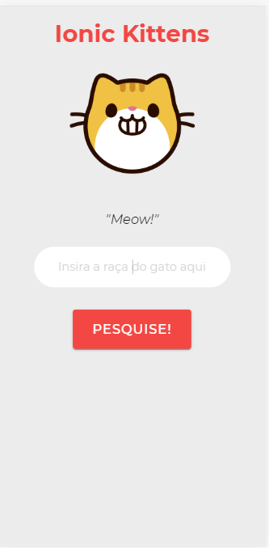
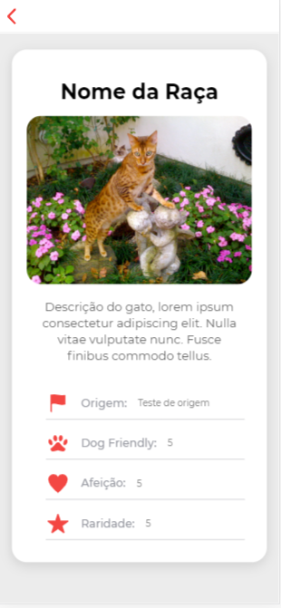

# :cat: Ionic Kittens

## Projeto Imersão - Fábrica de Software 2019.2
---

Nesse repositório você vai aprender como fazer um aplicativo incrível para aprender o nome de todas as raças dos gatos da vizinhaça. :cat2:


Para esse projeto usaremos apenas **7 passos** e pronto, aplicativo feito! :coffee:

**1. Configurando o ambiente**

Crie um novo projeto, aplicativo em branco com `ionic start {nome_do_app} blank`

**2. Entendendo um pouco mais a API**

APIs significam *"Application Programming Interface"*, ou seja, são conjuntos e padrões de alguma aplicação que é fornecido para outras aplicações usarem.

Para essa API usaremos a [TheCatAPI](https://thecatapi.com), que é uma API de classificação de raças de gatos.

Especificamente, usaremos esse endpoint: `api.thecatapi.com/v1/images/search?breed_ids={id_do_gato}`

Aqui nós conseguiremos pesquisar o gato pelo id, mostrar a foto, a descrição e 


**3. Primeiras alterações**

Antes de tudo, precisamos criar nossas páginas e classes principais.


* Para gerar a página de informações: `ionic generate page cat-info`

* Crie uma página com o nome de services, entre nela e dentro: `ionic generate services Cats`

**4. Alterando a página principal**

Vamos deixar a página inicial um pouco mais agradável e fazer algumas mudanças nela.

No seu home.page.html, altere:

````html
<ion-content center text-center>
    <ion-text color="primary">
      <h1>Ionic Kittens</h1>
    </ion-text>

    

    <ion-grid fixed>
      <ion-row>
        <ion-col size="12">
          <ion-text>
            <p id="descricao">"Meow!"</p>
          </ion-text>
        </ion-col>
      </ion-row>
    </ion-grid>

    <ion-input name="input" type="text" autofocus="true" autocomplete="on"  placeholder="Insira a raça do gato aqui"></ion-input>

    <!-- Botão para procurar o gato -->
    <ion-button id="btn" size="large" (click)="procurarGato(nome)" >
      Pesquise!
    </ion-button>


</ion-content>
````

Já no seu home.page.scss:

````scss
* {
    font-family: "Montserrat", sans-serif;
}

/*
    Mudando um pouco o background
*/
ion-content{
    --background: rgb(236, 236, 236);
}

/*
    Mudando um pouco o tamanho do h1
*/
h1{
    font-size: 36px;
    font-weight: bold;
}


//Mudando o estilo da imagem
#kitty{
    margin: 0 auto;
    width: 50%;
}

//Mudando o estilo da descrição
#descricao{
    color: #191919;
    font-size: 20px;
    font-style: italic;
}

/*
    Alterando os estilos do input
*/
ion-input{
    border-radius: 50px;
    margin: 0 auto;
    width: 300px;
    color: rgb(170, 170, 170);
    margin-bottom: 30px;
    --background: white;
    font-size: 18px;

    //Padding
    --padding-bottom: 20px;
    --padding-top: 20px;
    --padding-end: 20px;
    --padding-start: 20px;

    //Placeholder
    --placeholder-color: rgb(170, 170, 170);
}

//Estilos do botão
#btn{
    --padding-bottom: 30px;
    --padding-top: 30px;
    --padding-end: 30px;
    --padding-start: 30px;
}
````

Acabamos de estilar nossa página, e se dermos um `ionic serve` ela deve ficar mais ou menos assim:   



Mas ainda falta bastante trabalho, a próxima etapa é criar a página de perfil dos gatos.

**5. Alterando a página de perfil dos gatos**

Agora precisamos dar vida a página que entraremos quando pesquisarmos!


No seu cat-info-page.html:

````html
<ion-header>
  <ion-toolbar>
    <!-- Botão para voltar para a página anterior-->
    <ion-buttons slot="start">
      <ion-back-button text=""></ion-back-button>
    </ion-buttons>
  </ion-toolbar>
</ion-header>

<ion-content center text-center>
  <ion-card>
    <ion-card-header>
      <ion-card-title>Nome da Raça</ion-card-title>
    </ion-card-header>

    

    <ion-card-content>
      Descrição do gato, lorem ipsum consectetur adipiscing elit. Nulla vitae vulputate nunc. Fusce finibus commodo
      tellus.
    </ion-card-content>

    <ion-grid fixed>

      <!-- Item 1-->
      <ion-row>
        <ion-col size="12">
          <ion-item class="itens">
            <ion-icon class="icons" name="flag" size="large" color="primary"></ion-icon>
            <ion-text color="medium">
              <h4>Origem:</h4>
            </ion-text>
            <p>Teste de origem</p>
          </ion-item>
        </ion-col>
      </ion-row>

      <!-- Item 2-->
      <ion-row>
        <ion-col size="12">
          <ion-item class="itens">
            <ion-icon class="icons" name="paw" size="large" color="primary"></ion-icon>
            <ion-text color="medium">
              <h4>Dog Friendly: </h4>
            </ion-text>
            <p>5</p>
          </ion-item>
        </ion-col>
      </ion-row>

      <!-- Item 3-->
      <ion-row>
        <ion-col size="12">
          <ion-item class="itens">
            <ion-icon class="icons" name="heart" size="large" color="primary"></ion-icon>
            <ion-text color="medium">
              <h4>Afeição: </h4>
            </ion-text>
            <p>5</p>
          </ion-item>
        </ion-col>
      </ion-row>

      <!-- Item 4-->
      <ion-row>
        <ion-col size="12">
          <ion-item class="itens">
            <ion-icon class="icons" name="star" size="large" color="primary"></ion-icon>
            <ion-text color="medium">
              <h4>Raridade: </h4>
            </ion-text>
            <p>5</p>
          </ion-item>
        </ion-col>
      </ion-row>

    </ion-grid>

  </ion-card>
</ion-content>
````

E no seu cat-info.page.scss:

````scss
*{
    font-family: "Montserrat", sans-serif;
}

//Mudando estilos do background
ion-content{
    --background: rgb(236, 236, 236);
}

//Itens da lista
h4{
    margin: 0 15px;
    font-size: 15px;
}

//Imagem
img{
    border-radius: 20px;
}

//Card
ion-card{
    --background: white;
    border-radius: 20px;
    padding: 20px;
}
````

Depois desses passos, teremos uma página parecida com essa:



Agora nós temos um aplicativo bem massa, estilizado e pronto para ser integrado a API!

**6. Se conectando com uma API**

Nessa parte é onde nós faremos todos os passos essenciais para que nosso app se comunique bem com a API para nós pegarmos os dados necessários quando bem for preciso.

Precisaremos importar um módulo de conexão http, para isso nós precisamos fazer algumas modificações no nosso app.module.ts.

````typescript
import { NgModule } from '@angular/core';
import { BrowserModule } from '@angular/platform-browser';
import { RouteReuseStrategy } from '@angular/router';

import { IonicModule, IonicRouteStrategy} from '@ionic/angular';
import { SplashScreen } from '@ionic-native/splash-screen/ngx';
import { StatusBar } from '@ionic-native/status-bar/ngx';

import { AppComponent } from './app.component';
import { AppRoutingModule } from './app-routing.module';
import { HttpClientModule } from '@angular/common/http'
import { CatsService } from './services/cats.service';

@NgModule({
  declarations: [AppComponent],
  entryComponents: [],
  imports: [
    BrowserModule, 
    IonicModule.forRoot(), 
    AppRoutingModule,
    HttpClientModule, // <- Adicione essa linha
  ],
  providers: [
    StatusBar,
    SplashScreen,
    { provide: RouteReuseStrategy, useClass: IonicRouteStrategy },
    CatsService,
  ],
  bootstrap: [AppComponent]
})
export class AppModule {}


````

Na pasta services, abra o arquivo cats.services.ts

````typescript
import { Injectable } from '@angular/core';

import { HttpClient, HttpHeaders } from '@angular/common/http';
import { map } from 'rxjs/operators';
import { Observable } from 'rxjs';

//Url para o endpoint que usaremos
var baseUrl = "https://api.thecatapi.com/v1/images/search?breed_ids=";

@Injectable({
  providedIn: 'root'
})


export class CatsService {

  constructor(private http: HttpClient) { }

  //Nome do gato para a pesquisa
  nome: string = '';

  /*
    Nós precisamos fazer a comunicação da nossa aplicação com a The Cat API, para isso usaremos nosso token, e uma requisição do tipo GET.
  */
  procurarGato(nome: string): Observable<any>{
    return this.http.get(baseUrl + nome).pipe(map((res: any) => {
      return res;
    }))
    
  }
}
````

Agora temos uma conexão com a nossa API, precisamos ligar todas as páginas e para isso precisamos modificar a home.

No home.page.ts:

````typescript

import { Component} from '@angular/core';
import { Router } from '@angular/router';
import { CatsService } from '../services/cats.service';

@Component({
  selector: 'app-home',
  templateUrl: 'home.page.html',
  styleUrls: ['home.page.scss'],
})

export class HomePage {

  nome: string = '';

  constructor(private catSrvc: CatsService, private router: Router) {}

  //Remover o nome da caixa de pesquisa assim que o usuário sair da página
  ionViewDidLeave(){
    this.nome = '';
  }

  async procurarGato(nome: string){
    //Passar o nome para o service
    this.catSrvc.nome = this.nome;
    //Mover para a página cat-info
    this.router.navigateByUrl('/cat-info');
  }
}

````

**7. Fazendo a renderização dos dados da API**

Para fazer o display dinâmico dos dados recebidos da API nós alteraremos o conteúdo da página de perfil dos gatos.

No cat-info.page.ts:

````typescript
import { Component} from '@angular/core';
import { CatsService } from '../services/cats.service';
import { Router } from '@angular/router';
import { AlertController } from '@ionic/angular';


@Component({
  selector: 'app-cat-info',
  templateUrl: './cat-info.page.html',
  styleUrls: ['./cat-info.page.scss'],
})
export class CatInfoPage{

  constructor(private catsSrvc: CatsService, private router: Router, public alertController: AlertController) {
  }

  res: any = []
  results: any = {}

  //Variável auxiliar para verificar se a conexão com a API foi feita com sucesso
  carregou:boolean = false;
  
  //Antes da página carregar, ele realizará a função de procurar gato.
  ionViewWillEnter(){
    this.procurandoGato();
  }

  //Aqui nós temos uma função para procurar o gato na API
  async procurandoGato(){
    try{
      await this.catsSrvc.procurarGato(this.catsSrvc.nome).subscribe(data => {
        this.res = data;

        //Verificando se há ou não gatos com esse id na API
        if((Object.keys(this.res).length <= 0) ||this.catsSrvc.nome == ""){
        this.carregou = false;
        this.presentAlert();
        this.router.navigateByUrl('/home');
        }
        else{
          this.carregou = true;
        }
      })
    }
    catch(error){
      console.log(error);
    }
  }

  //Mostrar alerta
  async presentAlert() {
    const alert = await this.alertController.create({
      message: 'Não foi possível encontrar essa raça!',
      buttons: ['OK']
    });
  
    await alert.present();
  }
}

````

E por último, precisamos fazer o display desses dados na tela usando o angular Template Syntax

````html
<ion-header>
  <ion-toolbar>
    <!-- Botão para voltar para a página anterior-->
    <ion-buttons slot="start">
      <ion-back-button text=""></ion-back-button>
    </ion-buttons>
  </ion-toolbar>
</ion-header>

<ion-content center text-center>
  <!-- 
    Aqui vamos esperar os dados carregarem antes de popular a página
  -->
  <div *ngIf="carregou">
    <ion-card>

      <!-- Título -->
      <ion-card-header>
        <ion-card-title>{{res[0].breeds[0].name}}</ion-card-title>
      </ion-card-header>

      <!-- Imagem -->
      

      <ion-grid fixed>

        <!-- Item 1-->
        <ion-row>
          <ion-col size="12">
            <ion-item class="itens">
              <ion-icon class="icons" name="flag" size="large" color="primary"></ion-icon>
              <ion-text color="medium">
                <h4>Origem:</h4>
              </ion-text>
              <p>{{res[0].breeds[0].origin}}</p>
            </ion-item>
          </ion-col>
        </ion-row>

        <!-- Item 2-->
        <ion-row>
          <ion-col size="12">
            <ion-item class="itens">
              <ion-icon class="icons" name="paw" size="large" color="primary"></ion-icon>
              <ion-text color="medium">
                <h4>Dog Friendly: </h4>
              </ion-text>
              <p>{{res[0].breeds[0].dog_friendly}}</p>
            </ion-item>
          </ion-col>
        </ion-row>

        <!-- Item 3-->
        <ion-row>
          <ion-col size="12">
            <ion-item class="itens">
              <ion-icon class="icons" name="heart" size="large" color="primary"></ion-icon>
              <ion-text color="medium">
                <h4>Afeição: </h4>
              </ion-text>
              <p>{{res[0].breeds[0].affection_level}}</p>
            </ion-item>
          </ion-col>
        </ion-row>

        <!-- Item 4-->
        <ion-row>
          <ion-col size="12">
            <ion-item class="itens">
              <ion-icon class="icons" name="star" size="large" color="primary"></ion-icon>
              <ion-text color="medium">
                <h4>Raridade: </h4>
              </ion-text>
              <p>{{res[0].breeds[0].rare}}</p>
            </ion-item>
          </ion-col>
        </ion-row>

      </ion-grid>

    </ion-card>
  </div>


  <!--
    Se não carregar, temos um esqueleto simples para dar o feedback para o usuário
  -->

  <div *ngIf="!carregou">
    <ion-card>
      <ion-card-header>
        <ion-skeleton-text animated style="width: 80%; height: 30px; margin: 0 auto;"></ion-skeleton-text>
      </ion-card-header>

      <ion-skeleton-text animated style="width: 300px; height: 300px; margin: 0 auto;"></ion-skeleton-text>

      <ion-grid fixed>

        <!-- Item 1-->
        <ion-row>
          <ion-col size="12">
            <ion-item class="itens">
              <ion-icon class="icons" name="flag" size="large" color="primary"></ion-icon>
              <ion-text color="medium">
                <h4>Origem:</h4>
              </ion-text>
              <ion-skeleton-text animated style="width: 70%; height: 15px; margin: 0 auto;"></ion-skeleton-text>
            </ion-item>
          </ion-col>
        </ion-row>

        <!-- Item 2-->
        <ion-row>
          <ion-col size="12">
            <ion-item class="itens">
              <ion-icon class="icons" name="paw" size="large" color="primary"></ion-icon>
              <ion-text color="medium">
                <h4>Dog Friendly: </h4>
              </ion-text>
              <ion-skeleton-text animated style="width: 70%; height: 15px; margin: 0 auto;"></ion-skeleton-text>
            </ion-item>
          </ion-col>
        </ion-row>

        <!-- Item 3-->
        <ion-row>
          <ion-col size="12">
            <ion-item class="itens">
              <ion-icon class="icons" name="heart" size="large" color="primary"></ion-icon>
              <ion-text color="medium">
                <h4>Afeição: </h4>
              </ion-text>
              <ion-skeleton-text animated style="width: 70%; height: 15px; margin: 0 auto;"></ion-skeleton-text>
            </ion-item>
          </ion-col>
        </ion-row>

        <!-- Item 4-->
        <ion-row>
          <ion-col size="12">
            <ion-item class="itens">
              <ion-icon class="icons" name="star" size="large" color="primary"></ion-icon>
              <ion-text color="medium">
                <h4>Raridade: </h4>
              </ion-text>
              <ion-skeleton-text animated style="width: 70%; height: 15px; margin: 0 auto;"></ion-skeleton-text>
            </ion-item>
          </ion-col>
        </ion-row>

      </ion-grid>

    </ion-card>
  </div>

</ion-content>
````

###Resumão
---


